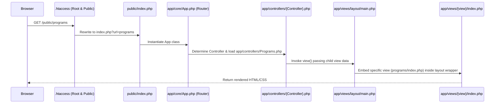

# Kids With Solutions Foundation (KWSF) - Developer Handover Guide

This guide is designed for developers taking over the maintenance, expansion, or deployment of the Kids With Solutions Foundation website. It details the system architecture, database layout, core utilities, front-end implementation, and deployment configurations.

---

## 1. System Architecture

The project is structured as a lightweight, custom **Model-View-Controller (MVC)** framework written in vanilla PHP. It does not use external framework dependencies (like Laravel or Symfony), making it fast, simple, and compatible with basic shared hosting environments.

### The Request Lifecycle
Whenever a user requests a page, the following sequence occurs:



1. **URL Rewriting**: 
   - The root [.htaccess](file:///Applications/XAMPP/xamppfiles/htdocs/KWSF/.htaccess) forwards all traffic to the [public/](file:///Applications/XAMPP/xamppfiles/htdocs/KWSF/public) directory.
   - The [public/.htaccess](file:///Applications/XAMPP/xamppfiles/htdocs/KWSF/public/.htaccess) handles clean URLs by capturing the route path and appending it as a query parameter: `index.php?url=$1`.
2. **Bootstrap Entrypoint**:
   - [public/index.php](file:///Applications/XAMPP/xamppfiles/htdocs/KWSF/public/index.php) includes [app/init.php](file:///Applications/XAMPP/xamppfiles/htdocs/KWSF/app/init.php), which boots the config and core classes, then instantiates the `App` router.
3. **Routing (`app/core/App.php`)**:
   - The [App](file:///Applications/XAMPP/xamppfiles/htdocs/KWSF/app/core/App.php) router parses the `url` parameter.
   - It maps the first segment of the URL path to a controller class name in [app/controllers/](file:///Applications/XAMPP/xamppfiles/htdocs/KWSF/app/controllers) (defaulting to `Home` if empty/invalid).
   - It maps the second segment to a method name inside that controller (defaulting to `index`).
   - Any subsequent segments are extracted as arguments and passed to the controller method via `call_user_func_array()`.
4. **Base Controller (`app/core/Controller.php`)**:
   - All controllers inherit from [Controller](file:///Applications/XAMPP/xamppfiles/htdocs/KWSF/app/core/Controller.php).
   - It provides helper methods to instantiate models (`model($modelName)`) and render templates (`view($viewPath, $data)`).
5. **View Rendering Layout Wrapper**:
   - Page views are nested inside a single wrapper: [app/views/layout/main.php](file:///Applications/XAMPP/xamppfiles/htdocs/KWSF/app/views/layout/main.php).
   - The layout injects global page metadata, configures Tailwind CSS via CDN, loads custom stylesheets, renders the global header/footer, and uses the `$data['view']` path to dynamically embed the child view file.

---

## 2. Database Architecture

The website includes forms that write directly to a MySQL/MariaDB database. The schema structure is automatically initialized by the controllers if the tables do not exist, ensuring a self-healing configuration.

### Connection & Port Fallback
To facilitate smooth development across local environments and production servers, [config.php](file:///Applications/XAMPP/xamppfiles/htdocs/KWSF/config.php) implements a dual-port fallback driver:

```php
try {
    // 1. Attempts connection with local custom port (e.g. XAMPP default MySQL port 3308)
    $conn = @mysqli_connect(DB_SERVER, DB_USERNAME, DB_PASSWORD, DB_NAME, DB_PORT);
    
    // 2. If that fails, falls back to the standard socket/port (e.g. 3306 for local default or cPanel)
    if ($conn === false || $conn === null) {
        $conn = @mysqli_connect(DB_SERVER, DB_USERNAME, DB_PASSWORD, DB_NAME);
    }
} catch (Exception $e) {
    $conn = null;
}
```

### Database Tables

#### Table: `registrations`
Stores student enrollment requests submitted via the `/register` page.

| Field Name | Type | Key | Null | Default | Description |
| --- | --- | --- | --- | --- | --- |
| `id` | `INT` | `PRI (AUTO_INCREMENT)` | `NO` | *None* | Unique registration ID |
| `first_name` | `VARCHAR(50)` | | `NO` | *None* | Parent/Guardian's first name |
| `last_name` | `VARCHAR(50)` | | `NO` | *None* | Parent/Guardian's last name |
| `email` | `VARCHAR(150)` | | `NO` | *None* | Parent/Guardian's email address |
| `phone_number`| `VARCHAR(20)` | | `NO` | *None* | Parent/Guardian's phone number |
| `module` | `VARCHAR(100)` | | `NO` | *None* | Selected program module (e.g., Coding & Robotics) |
| `child_first_name`| `VARCHAR(50)`| | `NO` | *None* | Learner's first name |
| `child_last_name`| `VARCHAR(50)`| | `NO` | *None* | Learner's last name |
| `child_age` | `INT` | | `NO` | *None* | Learner's age (between 3 and 20) |
| `child_gender`| `VARCHAR(15)` | | `NO` | *None* | Learner's gender (`Male` or `Female`) |
| `created_at` | `TIMESTAMP` | | `NO` | `CURRENT_TIMESTAMP`| Submission timestamp |

#### Table: `enquiries`
Stores message submissions from the `/contact` page.

| Field Name | Type | Key | Null | Default | Description |
| --- | --- | --- | --- | --- | --- |
| `id` | `INT` | `PRI (AUTO_INCREMENT)` | `NO` | *None* | Unique enquiry ID |
| `name` | `VARCHAR(100)` | | `NO` | *None* | Submitter's full name |
| `email` | `VARCHAR(150)` | | `NO` | *None* | Submitter's email address |
| `subject` | `VARCHAR(150)` | | `NO` | *None* | Category of inquiry (e.g., Partner, Donor, etc.) |
| `message` | `TEXT` | | `NO` | *None* | Full text of the message |
| `created_at` | `TIMESTAMP` | | `NO` | `CURRENT_TIMESTAMP`| Submission timestamp |

---

## 3. Form Processing & Mail Engine

KWSF uses a double-loop notification pattern to process incoming form requests. Forms validate backend inputs, log records in the MySQL database, and send branded emails.

### 1. Dual-Notification Email Flow
When a user successfully submits a form:
- **Notification to KWSF Admins**: Sent to `MAIL_TO_EMAIL` containing a clean table listing all submission details. The `Reply-To` header is set to the submitter's email so that admin replies route directly back to the sender.
- **Auto-reply to Submitter**: Sent to the submitter's email address acknowledging their submission, enclosing a copy of their input, and presenting a professional KWSF branded email template.

### 2. cPanel-Optimized Mail Header Configuration
To guarantee high email deliverability and avoid landing in spam folders, the mailer class [app/core/Mailer.php](file:///Applications/XAMPP/xamppfiles/htdocs/KWSF/app/core/Mailer.php) executes native PHP `mail()` with custom headers aligned with SPF, DKIM, and DMARC policies:

```php
$headers = [
    'MIME-Version: 1.0',
    'Content-Type: text/html; charset=UTF-8',
    'From: ' . MAIL_FROM_NAME . ' <' . MAIL_FROM_EMAIL . '>',
    'Reply-To: ' . $replyToEmail,
    'X-Mailer: PHP/' . phpversion()
];

$headersString = implode("\r\n", $headers);

// Force the envelope sender (-f) to match the approved domain email.
// Without this, the server envelope defaults to cPanel username @ serverhost, triggering DMARC alignment failures.
$additionalParams = '-f' . MAIL_FROM_EMAIL;

return @mail($to, $subject, $htmlContent, $headersString, $additionalParams);
```

### 3. Server-Side Validation Specs

#### Registration Controller (`app/controllers/Register.php`)
- **First Name, Last Name, Learner Names**: Regex `/^[a-zA-Z\s\-\']{2,50}$/` (requires letters, spaces, hyphens, or apostrophes; length 2-50).
- **Email**: Standard `FILTER_VALIDATE_EMAIL`.
- **Phone Number**: Regex `/^\+?[0-9\s\-()]{9,15}$/` (accommodates optional country code, digits, brackets, and hyphens; length 9-15).
- **Age**: Checked between `3` and `20`.
- **Gender**: Whitelisted against `Male` and `Female`.
- **Module**: Whitelisted against `Digital Literacy`, `Coding & Robotics`, `Financial Literacy`, `Leadership & Innovation`, and `Not sure yet`.

#### Contact Controller (`app/controllers/Contact.php`)
- **Name**: Regex `/^[a-zA-Z\s\-\']{2,100}$/`.
- **Email**: Standard `FILTER_VALIDATE_EMAIL`.
- **Topic**: Whitelisted against the predefined inquiry subjects.
- **Message**: Checked for length between `10` and `2000` characters.

---

## 4. Frontend & Design System

The KWSF frontend uses Tailwind CSS coupled with targeted custom transitions to create a clean, responsive layout.

### Custom Tailwind Theme Configuration
Tailwind is configured programmatically in [app/views/layout/main.php](file:///Applications/XAMPP/xamppfiles/htdocs/KWSF/app/views/layout/main.php) within the header layout:
```javascript
tailwind.config = {
    theme: {
        extend: {
            fontFamily: {
                sans: ['Plus Jakarta Sans', 'sans-serif'],
            },
            colors: {
                brand: {
                    blue: '#1f4e79',     /* Primary brand identity color */
                    green: '#2f855a',    /* Accent call-to-actions */
                    amber: '#d97706',    /* Warm highlights */
                    ink: '#0f172a',      /* Dark slate text */
                    surface: '#f6f8fb',  /* Clean page background tint */
                    muted: '#64748b',    /* Gray subheaders */
                }
            },
            boxShadow: {
                soft: '0 12px 30px rgba(15, 23, 42, 0.08)' /* Premium floating card shadows */
            }
        }
    }
}
```

### Input Field Visual Feedback
We implement immediate validation indicators without waiting for form submission. We use CSS `:user-invalid` styling combined with input blur event listeners:
- Fields do not show invalid styles until the user has interacted with them (via `:user-invalid` or a `data-touched="true"` attribute added on `blur`).
- Red borders (`border-red-500`) and light red backgrounds (`bg-red-50`) activate automatically if input constraints (like `type="email"`, `required`, or `pattern`) are violated.
- Screen-reader-friendly validation helper texts (`.error-msg`) display conditionally based on input state.

### Interactive SVG & CSS Animation Engine
The "Innovation Cycle" (Discover, Imagine, Create, Evolve) on the home and program pages is styled using [public/css/innovation-cycle.css](file:///Applications/XAMPP/xamppfiles/htdocs/KWSF/public/css/innovation-cycle.css).
- **Transitions**: Cards utilize cubic-bezier functions (`cubic-bezier(0.16, 1, 0.3, 1)`) for premium, low-friction hover scaling.
- **Timeline Dots**: Timeline markers grow and shift color on card hovers.
- **Active State Highlights**: Specific JS-driven utility classes (like `.js-active-discover`, `.node-active-discover`, and `.path-active-discover`) permit synchronized active state highlighting between HTML cards and the adjacent central SVG diagram.

---

## 5. Deployment Guide

Taking this project from local development (XAMPP) to a production shared cPanel server requires minimal configuration:

### Checklist for Production Launch

1. **Clean Code & Folders**:
   - Upload the entire directory (`app`, `public`, `config.php`, `.htaccess`) to the destination directory.
   - If hosting at the domain root (e.g. `https://kwsf.com/`), ensure all files sit inside the public root directory (typically `public_html`).
   
2. **URL Rewrite Check**:
   - Ensure the Apache module `mod_rewrite` is enabled on the server.
   - The root [.htaccess](file:///Applications/XAMPP/xamppfiles/htdocs/KWSF/.htaccess) automatically translates URLs, so no subfolders like `/public/` need to be typed in the web browser. The user simply loads `https://yourdomain.com/home`.

3. **Database Configuration**:
   - In cPanel, navigate to **MySQL Database Wizard**.
   - Create a database (e.g., `kwsf_register`).
   - Create a database user, assign a secure password, and grant **ALL PRIVILEGES** to the user for the created database.
   - Open [config.php](file:///Applications/XAMPP/xamppfiles/htdocs/KWSF/config.php) on the server and edit the database connection constants:
     ```php
     define('DB_SERVER', 'localhost'); // Set to localhost on cPanel
     define('DB_USERNAME', 'kwsf_dbuser');
     define('DB_PASSWORD', 'YourSecurePasswordHere');
     define('DB_NAME', 'kwsf_register');
     ```

4. **Update Mail Constants**:
   - Update `MAIL_TO_EMAIL` to the official address where learner and general contact submissions should be forwarded (e.g., `info@kwsf.org`).
   - Update `MAIL_FROM_EMAIL` to a verified address on the host domain (e.g., `no-reply@kwsf.org`). *IMPORTANT: Hosting providers will reject emails if the From address domain does not match the actual website host.*

5. **Enable HTTPS / SSL**:
   - Issue a Let's Encrypt SSL certificate via cPanel.
   - Force HTTPS redirects by adding the following rule directly beneath `RewriteEngine On` in the root [.htaccess](file:///Applications/XAMPP/xamppfiles/htdocs/KWSF/.htaccess) file:
     ```apache
     RewriteCond %{HTTPS} off
     RewriteRule ^(.*)$ https://%{HTTP_HOST}%{REQUEST_URI} [L,R=301]
     ```

6. **Privacy & Content checklist**:
   - Review [CONTENT_REVIEW_NOTES.md](file:///Applications/XAMPP/xamppfiles/htdocs/KWSF/CONTENT_REVIEW_NOTES.md) for a checklist of official contact numbers, addresses, privacy notices, and media approvals required before setting the website to public visibility.
